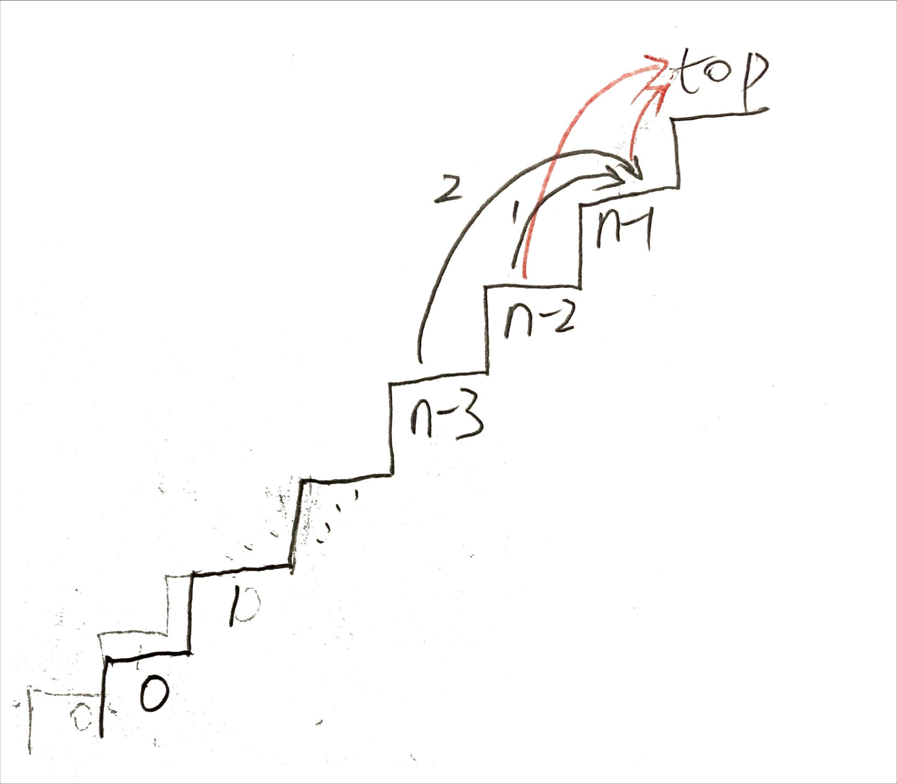

# Notes on solutions <!-- omit in toc -->

- [1. Two Sum](#1-two-sum)
- [2. Add Two Numbers](#2-add-two-numbers)
- [3. Longest Substring Without Repeating Characters](#3-longest-substring-without-repeating-characters)
- [4. Median of Two Sorted Arrays](#4-median-of-two-sorted-arrays)
- [5. Longest Palindromic Substring](#5-longest-palindromic-substring)
- [6. Zigzag Conversion](#6-zigzag-conversion)
- [7. Reverse Integer](#7-reverse-integer)
- [8. String to Integer (atoi)](#8-string-to-integer-atoi)
- [9. Palindrome Number](#9-palindrome-number)
- [10. Regular Expression Matching](#10-regular-expression-matching)
- [11. Container With Most Water](#11-container-with-most-water)
- [12. Integer to Roman](#12-integer-to-roman)
- [13. Roman to Integer](#13-roman-to-integer)
- [14. Longest Common Prefix](#14-longest-common-prefix)
- [70. Climbing Stairs](#70-climbing-stairs)
- [167. Two Sum II - Input Array Is Sorted](#167-two-sum-ii---input-array-is-sorted)
- [746. Min Cost Climbing Stairs](#746-min-cost-climbing-stairs)


<br/>
<div align="right">
    <b><a href="#top">↥ back to top</a></b>
</div>
<br/>


## [1. Two Sum](https://leetcode.com/problems/two-sum/)

**Hash table approach**

- Time complexity: O(n)
- Space complexity: O(n)


```python
class Solution:
    def twoSum(self, nums: list[int], target: int) -> list[int]:
        cache_dict = {}

        for i in range(len(nums)):
            res = target - nums[i]
            if res in cache_dict:
                return [cache_dict[res], i]
            else:
                cache_dict[nums[i]] = i
```


<br/>
<div align="right">
    <b><a href="#top">↥ back to top</a></b>
</div>
<br/>


## [2. Add Two Numbers](https://leetcode.com/problems/add-two-numbers/)

```python
class Solution:
    def addTwoNumbers(self, l1: Optional[ListNode], l2: Optional[ListNode]) -> Optional[ListNode]:
        node = ListNode()
        root = node

        if not l1:
            return l2
        if not l2:
            return l1
        
        node.val += l1.val + l2.val
        carry = node.val // 10
        node.val = node.val % 10
        l1 = l1.next
        l2 = l2.next

        while l1 or l2 or carry > 0:
            node.next = ListNode(carry)
            node = node.next

            if l1:
                node.val += l1.val
                l1 = l1.next

            if l2:
                node.val += l2.val
                l2 = l2.next

            carry = node.val // 10
            node.val = node.val % 10

        return root
```


<br/>
<div align="right">
    <b><a href="#top">↥ back to top</a></b>
</div>
<br/>


## [3. Longest Substring Without Repeating Characters](https://leetcode.com/problems/longest-substring-without-repeating-characters/)

Use one single pointer iterate through every char of the string, and with variable `start` recording the current substring without repeat char. Keep every char and its position in hash table for fast search (O(1)).

Whenever encountering a repeat char, all we need is to update the start of the target substring to be the next position of the repeat char (previous one). Anyway if this position is less than `start`, we won't update start (won't go back). 

That is to say, only the repeat char in the range of target substring is what we care about, which will be the pivot point for updating `start`. Those repeat chars in the position before current `start` are irrelevant. 

The length of current substring is `j - start + 1`. So in every iteration, just update max length to be the greater one of `maxlen, j - start + 1`.

- Time complexity: O(n)
- Space complexity: O(n)

```python
class Solution:
    def lengthOfLongestSubstring(self, s: str) -> int:
        char_table = dict()
        maxlen = 0
        start = 0   # record the start pos of substring
        for j, c in enumerate(s):
            if c in char_table:
                start = max(start, char_table[c] + 1)  # update start pos if elligible
        
            maxlen = max(maxlen, j - start + 1) # update max length so far
            char_table[c] = j

        return maxlen
```


<br/>
<div align="right">
    <b><a href="#top">↥ back to top</a></b>
</div>
<br/>

## [4. Median of Two Sorted Arrays](https://leetcode.com/problems/median-of-two-sorted-arrays/)

To get a median of a sorted array `nums`: 

```python
median = (nums[(len(nums) - 1) // 2] + nums[len(nums) // 2]) / 2
```

**Method 1**:

<details>

<summary>With two given sorted arrays, to get a median, we can just merge the two sorted arrays and compute the median.</summary>
<br/>
To merge two sorted arrays the most direct way is to iterate the two arrays at the same time, who comes first stands out of the array and move to next and compare again. Until one array is exhausted, just concat the rest of the other. This operation is linear time.

```python
class Solution:
    def findMedianSortedArrays(self, nums1: List[int], nums2: List[int]) -> float:
        nums = self.mergeList(nums1, nums2)
        return (nums[(len(nums) - 1) // 2] + nums[len(nums) // 2]) / 2

    def mergeList(self, nums1, nums2):
        nums = []

        if (len(nums1) == 0): return nums2
        if (len(nums2) == 0): return nums1

        i, j = 0, 0
        while (i < len(nums1) or j < len(nums2)):
            if (i == len(nums1)):
                nums.extend(nums2[j:])
                break

            if (j == len(nums2)):
                nums.extend(nums1[i:])
                break

            if (nums1[i] < nums2[j]):
                nums.append(nums1[i])
                i += 1
            else:
                nums.append(nums2[j])
                j += 1

        return nums
```

</details>

**Method 2**:

<details>

<summary>We can optimize the merging step by shrinking merging elements.</summary>
<br/>

Compute medians of each array, say, `median1` and `median2`. If `median1` and `median2` are equal, we can tell this median is the median of two arrays. If `median1 < median2`, then the median of the two arrays will be some number in the range from `median1` to `median2`. So, for each array, those numbers outside this range will be let alone, we don't need to bother to merge them. With this in mind, we can shrink the two sorted arrays significantly to much less elements. For example, 

```python
nums1 = [1,3,5,11,12]   # median1 = 5
nums2 = [2,4,7,8,9,13]  # median2 = 7.5
```
For `nums1`, we don't care `1,3` (left side elements) and `11,12` (right side elements), and for `nums2`, `2,4` (left side elements) and `9,13` (right side elements). We won't iterate these elements in the merging step. Instead of merging `nums1` and `nums2`, we just merge `[5]` (middle part elements) and `[7,8]` (middle part elements), which is `[5,7,8]` by much less iteration. To get a whole array, just extend the list by (left, middle, right): `[1,3] + [2,4] + [5,7,8] + [11,12] + [9,13]` (for those in the left or right side, order doesn't matter):

```python
nums = [1,3,2,4,5,7,8,11,12,9,13]   # median = 7
```
We don't need to get a sorted version to get a median! Unfortunately, [time complexity](https://wiki.python.org/moin/TimeComplexity) of list extend operation in python is O(n).

*Now, how to get the middle side elements of each array effieciently?*

**Binary search**. For `nums1`, we already know where `5` is and what we need to do is to find the *floor* element of `median2` in `nums1`. Vice versa, get the *ceiling* elemnt of `median1` in `nums2`. Use binary search to do this, which might totally have time complexity of O(log(mn)) in this case. 

Furthermore, we actually don't need to concat left part arrays, only their length matters. So calculation of this problem (A) simply reduces to find the particular element in the middle part of arrays:

```python
median = (nums_middle[(len - 1) // 2 - len_left] + nums_middle[len // 2 - len_left]) / 2
```

[full code](../solutions/4.%20Median%20of%20Two%20Sorted%20Arrays/median_two_sorted_3.py), this version runs for **113 ms**.

</details>

**Method 3**:

<details>

<summary>The analysis above can help think further, this problem can be transformed to another problem (B): 

***Find the i<sup>th</sup> element in two sorted arrays***
</summary>

If we can find the i<sup>th</sup> element, all we need to do is to find the element(s) at `(m + n - 1) // 2` and `(m + n) / 2` to get the median. And also, we can compare medians to get two much smaller sorted arrays to reduce recursive cost.

To find the i<sup>th</sup> element in two sorted arrays, the method is analogue to find the middle part subarray in the range from `median1` to `median2` stated in the *Method2*. Use the binary search to find the left side element of each array which gradually approaches the target.

1. find the ceiling (smallest one greater than) of the start element of `nums2` in `nums1`, index is `k`. (use binary search)
2. if `i < k`, then return `nums1[i]`,
3. otherwise, cut `nums1` to `nums1[k:]`, exchange `nums1` and `nums2`, set `i` to `i-k`, repeat step 1.

Write it in recursive function, [full code](../solutions/4.%20Median%20of%20Two%20Sorted%20Arrays/median_two_sorted_4.py), the code runs for **156 ms**.

```python
def findElement(self, nums1, nums2, index):
    """
    find the element at index of the two sorted arrays, recursively
    return: a list containing the element
    """

    if (len(nums1) == 0): return nums2[index:index+1]   # can be [] if index out of range
    if (len(nums2) == 0): return nums1[index:index+1]   # can be [] if index out of range

    cut1 = self.getCeilingNoEqual(nums1, nums2[0])
    if (cut1 > index): return nums1[index:index+1]
    else: 
        return self.findElement(nums2, nums1[cut1:], index - cut1)
```

Since slicing operation in python is O(k) of [time complexity](https://wiki.python.org/moin/TimeComplexity), we can rewrite it without slicing, [full code](../solutions/4.%20Median%20of%20Two%20Sorted%20Arrays/median_two_sorted_7.py):

```python
def findElement2(self, nums1, left1, right1, nums2, left2, right2, index):
    """
    find the element at index of the two sorted arrays, recursively
    index: full scope index (absolute position)
    return: the element
    """

    if (left1 >= right1): return index - left1 < right2 and nums2[index - left1] or None 
    if (left2 >= right2): return index - left2 < right1 and nums1[index - left2] or None 

    newLeft1 = self.getCeilingNoEqual(nums1, left1, right1, nums2[left2])
    if (newLeft1 > index - left2): 
        return nums1[index - left2]
    else: 
        return self.findElement2(nums2, left2, right2, nums1, newLeft1, right1, index)
```

As a comparison, this version runs for **115 ms**. And recursion is more expensive than iteration in Python because it requires the allocation of a new stack frame every time. So we can further rewrite it in loops, [full code](../solutions/4.%20Median%20of%20Two%20Sorted%20Arrays/median_two_sorted_8.py):

```python
def findElement3(self, nums1, left1, right1, nums2, left2, right2, index):
    while True:
        if (left1 >= right1): return index - left1 < right2 and nums2[index - left1] or None 
        if (left2 >= right2): return index - left2 < right1 and nums1[index - left2] or None 

        newLeft1 = self.getCeilingNoEqual(nums1, left1, right1, nums2[left2])
        if (newLeft1 > index - left2): 
            return nums1[index - left2]
        else: 
            nums1, nums2 = nums2, nums1
            left1, left2 = left2, newLeft1
            right1, right2 = right2, right1
```

It runs for **101 ms**.

But `findElement` to find i<sup>th</sup> element is not optimal, every step needs a binary search. The core idea in this method is to use a left hand to approch the target i<sup>th</sup> element. If the target is at the right side, it needs more time. For example, if we want to find `17`th element, this function costs nearly `nlogn`. To find the right side target, it is better to use right hand to approach the target (should call some `getFloorNoEqual` in the iteration). So although this function can solve the problem, it is not *balanced* and the time complexity is approximately O(min(mlogn, nlogm)). Right side target costs more time than left side target due to its intrinsic unbalanced logic.

```python
nums1 = [1,2,3,4,5,6,7,8,9]
nums2 = [1,2,3,4,5,6,7,8,9]
```

Recall that at the beginning of *Method2* we state that if `median1 < median2` then the median of the two arrays will be some number in the range from `median1` to `median2`. This is equivalent to that the target median will be not in the left half of `nums1` or the right half of `nums2`. If `i` (i<sup>th</sup> element) is greater than the index of the target median, then it is certain that i<sup>th</sup> element will be in the left half of `nums1`. Vice versa, if `i` is less than the median index, i<sup>th</sup> element will be in the right half of `nums2`.

Generally for k1<sup>th</sup> in `nums1` and k2<sup>th</sup> in `nums2`, if `i > k1 + k2`, and `nums1[k1] < nums2[k2]`. Then i<sup>th</sup> will be certainly not in the subarray in the left of k1<sup>th</sup>. So we can also use binary search idea to approach the target i<sup>th</sup> by using median index in every iteration. 

```python
def findElement4(self, nums1, left1, right1, nums2, left2, right2, index):
    while True:
        if (left1 > right1): return nums2[index - left1]
        if (left2 > right2): return nums1[index - left2]

        i1 = (left1 + right1) // 2
        i2 = (left2 + right2) // 2

        num1, num2 = nums1[i1], nums2[i2]

        if index <= i1 + i2:
            if num1 < num2:
                right2 = i2 - 1
            else:
                right1 = i1 - 1
        else:
            if num1 < num2:
                left1 = i1 + 1
            else:
                left2 = i2 + 1
```

It runs for **93 ms**. [full code](../solutions/4.%20Median%20of%20Two%20Sorted%20Arrays/median_two_sorted_9.py). Time complexity is O(log(m)+log(n)) < O(log(m+n)).

</details>


<br/>
<div align="right">
    <b><a href="#top">↥ back to top</a></b>
</div>
<br/>


## [5. Longest Palindromic Substring](https://leetcode.com/problems/longest-palindromic-substring/)

Using [Manacher's algorithm](https://en.wikipedia.org/wiki/Longest_palindromic_substring) for longest palindromic substring.

```python
class Solution:
    """
    Manacher's algorithm
    https://en.wikipedia.org/wiki/Longest_palindromic_substring
    
    """
    def longestPalindrome(self, s: str) -> str:
        ss = ''.join(['|' + c for c in s] + ['|'])
        palinRadius = [0] * len(ss)

        ii = 0  # center index, iterating ss "|b|a|b|a|b|" when s "babab"
        radius = 0
        while ii < len(ss):
            while (ii - (radius+1) >= 0 and ii + (radius+1) < len(ss)) and (ss[ii - (radius+1)] == ss[ii + (radius+1)]):
                radius += 1

            palinRadius[ii] = radius

            oldCenter = ii
            oldRadius = radius
            ii = ii+1
            
            radius = 0 
            while ii <= oldCenter + oldRadius:
                mirroredCenter = oldCenter - (ii - oldCenter)
                maxMirroredRadius = oldCenter + oldRadius - ii
                if palinRadius[mirroredCenter] < maxMirroredRadius:
                    palinRadius[ii] = palinRadius[mirroredCenter]
                    ii = ii+1
                elif palinRadius[mirroredCenter] > maxMirroredRadius:
                    palinRadius[ii] = maxMirroredRadius
                    ii = ii+1
                else:
                    palinRadius[mirroredCenter] = maxMirroredRadius
                    radius = maxMirroredRadius # main while loop will start from here, expand the radius if elligible
                    break # exit while loop early

        max1 = max(palinRadius)
        index1 = [i for i, v in enumerate(palinRadius) if v == max1]

        print(palinRadius)
        print(index1)

        if index1:
            ii = index1[0]
            palinSS = ss[ii - (palinRadius[ii]):ii + (palinRadius[ii])+1]
            palinS = ''.join([c for c in palinSS if c != '|'])
            return palinS
            
        return ""
```

<br/>
<div align="right">
    <b><a href="#top">↥ back to top</a></b>
</div>
<br/>


## [6. Zigzag Conversion](https://leetcode.com/problems/zigzag-conversion/)

```python
class Solution:
    def convert(self, s: str, numRows: int) -> str:
        if numRows == 1: return s
        numPattern = 2 * (numRows - 1)      # repeat pattern substring

        matrix = []
        for k in range(numRows):
            matrix.append([])
            
        for i in range(len(s)):
            row = i % numPattern
            if row >= numRows:
                row = numPattern - row
            matrix[row].append(s[i])
        
        matrix = sum(matrix, [])
        newStr = ''.join(matrix)
        return newStr
```

<br/>
<div align="right">
    <b><a href="#top">↥ back to top</a></b>
</div>
<br/>


## [7. Reverse Integer](https://leetcode.com/problems/reverse-integer/)

```python
class Solution:
    def reverse(self, x: int) -> int:
        sign = x < 0 and -1 or 1
        r = str(x * sign)[::-1]
        return 0 if (len(r) == 10 and r > str(2**31)) else int(r) * sign
```

<br/>
<div align="right">
    <b><a href="#top">↥ back to top</a></b>
</div>
<br/>


## [8. String to Integer (atoi)](https://leetcode.com/problems/string-to-integer-atoi/)

```python
class Solution:
    def myAtoi(self, s: str) -> int:
        sign, n, digitOn = 1, 0, False
        MIN, MAX = -2**31, 2**31 - 1

        for i in range(len(s)):
            if digitOn and (s[i] < '0' or s[i] > '9'):
                break
            if not digitOn:
                if s[i] == ' ':
                    continue
                elif s[i] == '-':
                    sign, digitOn = -1, True
                elif s[i] == '+':
                    digitOn = True
                    continue
                elif s[i] < '0' or s[i] > '9':
                    break
            if s[i] >= '0' and s[i] <= '9':
                digitOn = True
                digit = ord(s[i]) - ord('0')
                if n > MAX // 10 or (n == MAX // 10 and digit > MAX % 10):
                    return MAX if sign == 1 else MIN
                n *= 10
                n += digit

        return n * sign
```

<br/>
<div align="right">
    <b><a href="#top">↥ back to top</a></b>
</div>
<br/>


## [9. Palindrome Number](https://leetcode.com/problems/palindrome-number/)

```python
class Solution:
    def isPalindrome(self, x: int) -> bool:
        y, x0 = 0, x
        while x0 > 0:
            a, x0 = x0 % 10, x0 // 10
            y = 10 * y + a

        return x == y
```


<br/>
<div align="right">
    <b><a href="#top">↥ back to top</a></b>
</div>
<br/>

## [10. Regular Expression Matching](https://leetcode.com/problems/regular-expression-matching/)

**TODO**

<br/>
<div align="right">
    <b><a href="#top">↥ back to top</a></b>
</div>
<br/>


## [11. Container With Most Water](https://leetcode.com/problems/container-with-most-water/)

This problem can be accomplished via intuitively by using two pointers, from leftmost and from rightmost, which can form the most widest container. Within each step, skip a shorter vertical line. The time complexity is O(n).

```python
class Solution:
    def maxArea(self, height: List[int]) -> int:
        left = i = 0
        right = j = len(height) - 1

        minHeight = min(height[left], height[right])
        maxArea = minHeight * (right - left)

        while i < j:

            if height[i] < height[j]:
                i += 1
            else:
                j -= 1

            mH = min(height[i], height[j])
            if mH < minHeight:
                continue

            area = mH * (j - i)
            if area > maxArea:
                left = i
                right = j
                minHeight = mH
                maxArea = area
                # print("left: ", left, height[left])
                # print("right: ", right, height[right])

        return maxArea
        # return left, right, maxArea
```

The code can be simplified to only a few lines since only `maxArea` is what we want:

```python
class Solution2:
    def maxArea(self, height: List[int]) -> int:
        i = 0
        j = len(height) - 1

        maxArea = 0

        while i < j:

            area = min(height[i], height[j]) * (j - i)
            if area > maxArea:
                maxArea = area

            if height[i] < height[j]:
                i += 1
            else:
                j -= 1

        return maxArea
```


<br/>
<div align="right">
    <b><a href="#top">↥ back to top</a></b>
</div>
<br/>

## [12. Integer to Roman](https://leetcode.com/problems/integer-to-roman/)

```python
class Solution:
    def intToRoman(self, num: int) -> str:
        integers = [1,4,5,9,10,40,50,90,100,400,500,900,1000]
        letters = ['I','IV','V','IX','X','XL','L','XC','C','CD','D','CM','M']
        result = ''

        for i in reversed(range(len(integers))):
            f = num // integers[i]
            if f > 0:
                num = num % integers[i]
                result += f * letters[i]
            
            if num == 0:
                break

        return result
```

<br/>
<div align="right">
    <b><a href="#top">↥ back to top</a></b>
</div>
<br/>


## [13. Roman to Integer](https://leetcode.com/problems/roman-to-integer/)

```python
class Solution:
    def romanToInt(self, s: str) -> int:
        integers = [1,4,5,9,10,40,50,90,100,400,500,900,1000]
        letters = ['I','IV','V','IX','X','XL','L','XC','C','CD','D','CM','M']
        result = 0

        i = len(letters) - 1
        while i >= 0:
            if s[0:len(letters[i])] == letters[i]:
                result += integers[i]
                s = s[len(letters[i]):]
            else:
                i -= 1

        return result
```

<br/>
<div align="right">
    <b><a href="#top">↥ back to top</a></b>
</div>
<br/>

## [14. Longest Common Prefix](https://leetcode.com/problems/longest-common-prefix/)

```python
class Solution:
    def longestCommonPrefix(self, strs: List[str]) -> str:
        if not strs: return ""

        lcp = ""
        s1 = min(strs)
        s2 = max(strs)

        n = min(len(s1), len(s2))

        for d in range(n):
            if s1[d] != s2[d]:
                break
            lcp += s1[d]

        return lcp
```


<br/>
<div align="right">
    <b><a href="#top">↥ back to top</a></b>
</div>
<br/>


## [70. Climbing Stairs](https://leetcode.com/problems/climbing-stairs/)

If we count steps from top to bottom, things will be more easier to understand. 
- Start from the topmost stair which is the 0<sup>th</sup> level, we have the only one way to the top since we are already at the top. 
- Then the next down step is the 1<sup>st</sup> level, we have the only one way to the top since we can only climb 1 step to the top.
- Then at 2<sup>nd</sup> level, we have two options, climbing 1 step to the 1<sup>st</sup> level which has one way to the top and climbing 2 steps to the 0<sup>th</sup> level which has one way to the top. So at 2<sup>nd</sup> level we have two ways to the top.
- Similarly, with 1 step or 2 steps, we can climb to the previous first level or the previous second level, with memoization, we already have how many ways we can get to the top from these two levels, so we can sum up to get how many ways we can get to the top from current level.
- This is the Fibonacci series.
- Solve the Fibonacci series with dynamic programming method.


```python
class Solution:
    def climbStairs(self, n: int) -> int:
        a, b = 1, 1
        for i in range(n):
            a, b = b, a + b
        return a
```

```python
class Solution2:
    def climbStairs(self, n: int) -> int:
        fib = [1] * 2
        for k in range(2,n + 1):
            fib[k%2] = fib[(k-1)%2] + fib[(k-2)%2]
        return fib[n%2]
```

The second one is much faster than the first one which actually takes more assignment operations. 


<br/>
<div align="right">
    <b><a href="#top">↥ back to top</a></b>
</div>
<br/>


## [167. Two Sum II - Input Array Is Sorted](https://leetcode.com/problems/two-sum-ii-input-array-is-sorted/)

**Hash table approach**

We can also solve this problem using hash table approach (see [1. Two Sum](#1-two-sum)). 

- Time complexity: O(n)
- Space complexity: O(n)


**Binary search approach**

Since the input array is sorted, we can easily think of the binary search method, which costs less space.

- Time complexity: O(nlogn)
- Space complexity: O(1)

```python
# binary search approach
class Solution:
    def twoSum(self, numbers: List[int], target: int) -> List[int]:
        for i in range(len(numbers)):
            lo = i + 1
            hi = len(numbers) - 1
            key = target - numbers[i]

            while lo <= hi:
                mid = math.floor((lo + hi) / 2)
                if key < numbers[mid]:
                    hi = mid - 1
                elif key > numbers[mid]:
                    lo = mid + 1
                else:
                    return [i+1, mid+1]
```

<details>

<summary>Ideas to improve the performance: </summary>


> In the binary search approach, we iterate from left to right with `i` and search for `target-numbers[i]` within all numbers to the right of number `i` by binary search. 
> 
> For `i`, at the end of `while` loop, if we don't get the match, `hi` will stop at some place, say, `j`. 
> 
> In the next iteration `i+1`, whether we get the match or not, after the `while` loop exits, `hi` will not be greater than `j`, since the input array is in non-decreasing order.
> 
> For example, `numbers = [1, 3, 4, 5, 8, 10, 13, 20, 21]`, `target = 15`. 
> 
> For `i = 0` (nubmer **1**), after `while` exit, `lo = 7`, `hi = 6`, `mid = 7`, we get `lo > hi`, which means we didn't get the sum match. 
> 
> Now, `hi` stops at number **13**. Increment `i` to move to the next number **3**, we actually don't need to bother considering the numbers on the right side of number 13 since the array is non-decreasing. 
> 
> Can we improve the performance of this binary search approach by using previous `hi` value in the next loop to reduce cost? In other words, in every iteration, we just update `lo` to start over from `i+1` and don't reset `hi` to `len(numbers) - 1`. With minor modification, the code looks like this:
> 
> ```python
> # binary search approach modification
> def twoSum(self, numbers: List[int], target: int) -> List[int]:
>     hi = len(numbers) - 1
>     for i in range(len(numbers)):
>         lo = i + 1
>         key = target - numbers[i]
> 
>         while lo <= hi:
>             mid = math.floor((lo + hi) / 2)
>             if key < numbers[mid]:
>                 hi = mid - 1
>             elif key > numbers[mid]:
>                 lo = mid + 1
>             else:
>                 return [i+1, mid+1]
> ```
> 
> This code solves the problem just like the original one, but the improvement is negligible for the binary search strategy. With the following example, we have so many duplicate numbers, so we will do a lot of binary search in vain.
> 
> `numbers = [1, 1, 1, 1, 1, 1, 1, 3, 4, 5, 8, 10, 13, 20], target = 15`
> 
> As `i` iterating through number **1**s, and the while loop doing the futile binary search, `hi` is just waiting at the position of number **13**. 
> 
> So, the usage of the binary search for this problem can be demoted to some pointer, which I call it lazy pointer `j`, starting from the rightmost, recording the possible position for `target-numbers[i]`. With this idea, we get the two-pointer approach.

</details>

**Two-pointer approach**

Use two pointers `i` and `j`, from left to right and from right to left, to find if `numbers[i] + numbers[j] == target` is successful. If less, move `i` a little to right, if greater, move `j` a little to left. This two-pointer approach is faster than binary search approach.

- Time complexity: O(n)
- Space complexity: O(1)

```python
# two-pointer approach
class Solution:
    def twoSum(self, numbers: List[int], target: int) -> List[int]:
        lo = 0
        hi = len(numbers) - 1

        while lo < hi:
            if (numbers[lo] + numbers[hi] == target):
                return [lo + 1, hi + 1]
            if (numbers[lo] + numbers[hi] < target):
                lo += 1
            else:
                hi -= 1
```


<br/>
<div align="right">
    <b><a href="#top">↥ back to top</a></b>
</div>
<br/>


## [746. Min Cost Climbing Stairs](https://leetcode.com/problems/min-cost-climbing-stairs/)

**Method 1:**

</img>

This problem has an **optimal substructure** (optimal solutions to a problem incorporate optimal solutions to related subproblems, which we may solve independently). To get the step `i`, we can climb from step `i-1` or `i-2`, of which the minimal cost we denote as `c[i-1]` and `c[i-2]`. We can start from step `i` to the next one step or two steps with the minimal cost `c[i] = cost[i] + min(c[i-1], c[i-2])`. 

In this formulation, an optimal solution embodies the solution to two related subproblem—minimal cost starting from the previous two steps.

**Recursive top-down implementation**

```python
class Solution:
    """
    naive recursive solution
    """
    def minCostClimbingStairs(self, cost: List[int]) -> int:
        return min(self.min_cost(cost, len(cost) - 1), self.min_cost(cost, len(cost) - 2))

    def min_cost(self, cost: List[int], i: int) -> int:
        if i == 0 or i == 1:
            return cost[i]

        return cost[i] + min(self.min_cost(cost, i - 1), self.min_cost(cost, i - 2))
```

However the code is not efficient which will easily get an `Time Limit Exceeded` error when input is of length 1000 or more. The [time complexity of this recursion function](https://stackoverflow.com/questions/13467674/determining-complexity-for-recursive-functions-big-o-notation) is O(2<sup>n</sup>).

**Using dynamic programming for optimal climbing**

Having observed that the recursive solution is inefficient because solves the same subproblems repeatedly, we can arrange for each subproblem to be solved only once, saving its solution. If we need to refer to this subproblem’s solution again later, we can just look it up, rather than recompute it. 

Dynamic programming thus uses additional memory to save computation time; it serves an example of a **time-memory trade-off**. The savings may be dramatic: an exponential-time solution may be transformed into a polynomial-time solution. There are two equivalent ways to implement dynamic-programming approach:
- **top-down with memoization**: write the procedure recursively in a natural manner, but modified to save the result of each subproblem (in an array or hash table). 

```python
class Solution:
    """
    recursive solution with memoization
    """
    def minCostClimbingStairs(self, cost: List[int]) -> int:
        c = [0] * len(cost)
        return min(self.min_cost(cost, len(cost) - 1, c), self.min_cost(cost, len(cost) - 2, c))

    def min_cost(self, cost: List[int], i: int, c: List[int]) -> int:
        if i == 0 or i == 1:
            return cost[i]

        if c[i] != 0: return c[i]

        c[i] = cost[i] + min(self.min_cost(cost, i - 1, c), self.min_cost(cost, i - 2, c))

        return c[i]
```

- **bottom-up method**: sort the subproblems by size and solve them in size order, smallest first.

```python
class Solution:
    """
    bottom-up solution
    """
    def minCostClimbingStairs(self, cost: List[int]) -> int:
        c = [0] * len(cost)
        for i in range(len(cost)):
            if i < 2: 
                c[i] = cost[i]
            else:
                c[i] = cost[i] + min(c[i - 1], c[i - 2])

        return min(c[len(cost) - 1], c[len(cost) - 2])
```

For example, Input: cost = [10,15,20]. 

The **subproblem graph** contains edges from *x* to *y* if a top-down recursive procedure for solving *x* directly calls itself to solve *y*. We can view the top-down method (with memoization) for dynamic programming as a "depth-first search" of the subproblem graph.


This graph is a reduced version of the tree below. In a bottom-up dynamic-programming algorithm, we consider the vertices of the subproblem graph in an order that is a "reverse topological sort".


**Method 2:**


If we consider the problem from the top, and denote `c[i]` as the cost start from step `i` to the top (disregard with previous steps). We can have the analogue analysis as above. Bottom-up solution is:

```python
class Solution:
    def minCostClimbingStairs(self, cost: List[int]) -> int:
        c = cost
        c.append(0)

        for i in range(len(c) - 3, -1, -1):
            c[i] += min(c[i + 1], c[i + 2]) # update i step minimal cost to the top

        return min(c[0], c[1])
```


<br/>
<div align="right">
    <b><a href="#top">↥ back to top</a></b>
</div>
<br/>

