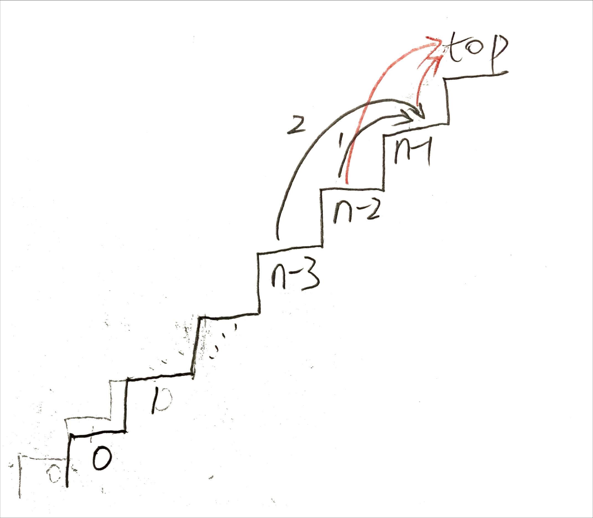
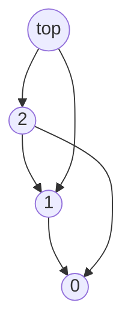
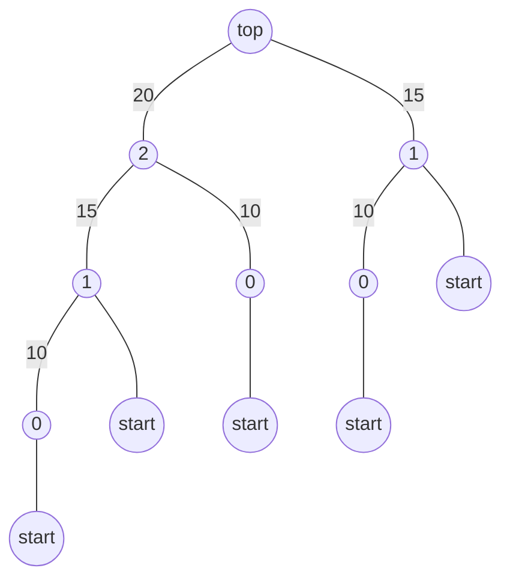
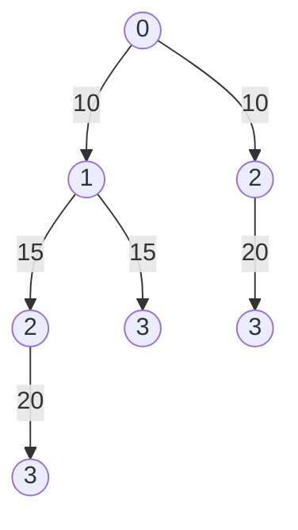

## [746. Min Cost Climbing Stairs](https://leetcode.com/problems/min-cost-climbing-stairs/)

**Method 1:**

 

This problem has an **optimal substructure** (optimal solutions to a problem incorporate optimal solutions to related subproblems, which we may solve independently). To get the step `i`, we can climb from step `i-1` or `i-2`, of which the minimal cost we denote as `c[i-1]` and `c[i-2]`. We can start from step `i` to the next one step or two steps with the minimal cost `c[i] = cost[i] + min(c[i-1], c[i-2])`. 

In this formulation, an optimal solution embodies the solution to two related subproblem—minimal cost starting from the previous two steps.

**Recursive top-down implementation**

```python
class Solution:
    """
    naive recursive solution
    """
    def minCostClimbingStairs(self, cost: List[int]) -> int:
        return min(self.min_cost(cost, len(cost) - 1), self.min_cost(cost, len(cost) - 2))

    def min_cost(self, cost: List[int], i: int) -> int:
        if i == 0 or i == 1:
            return cost[i]

        return cost[i] + min(self.min_cost(cost, i - 1), self.min_cost(cost, i - 2))
```

However the code is not efficient which will easily get an `Time Limit Exceeded` error when input is of length 1000 or more. The [time complexity of this recursion function](https://stackoverflow.com/questions/13467674/determining-complexity-for-recursive-functions-big-o-notation) is O(2<sup>n</sup>).

**Using dynamic programming for optimal climbing**

Having observed that the recursive solution is inefficient because solves the same subproblems repeatedly, we can arrange for each subproblem to be solved only once, saving its solution. If we need to refer to this subproblem’s solution again later, we can just look it up, rather than recompute it. 

Dynamic programming thus uses additional memory to save computation time; it serves an example of a **time-memory trade-off**. The savings may be dramatic: an exponential-time solution may be transformed into a polynomial-time solution. There are two equivalent ways to implement dynamic-programming approach:
- **top-down with memoization**: write the procedure recursively in a natural manner, but modified to save the result of each subproblem (in an array or hash table). 

```python
class Solution:
    """
    recursive solution with memoization
    """
    def minCostClimbingStairs(self, cost: List[int]) -> int:
        c = [0] * len(cost)
        return min(self.min_cost(cost, len(cost) - 1, c), self.min_cost(cost, len(cost) - 2, c))

    def min_cost(self, cost: List[int], i: int, c: List[int]) -> int:
        if i == 0 or i == 1:
            return cost[i]

        if c[i] != 0: return c[i]

        c[i] = cost[i] + min(self.min_cost(cost, i - 1, c), self.min_cost(cost, i - 2, c))

        return c[i]
```

- **bottom-up method**: sort the subproblems by size and solve them in size order, smallest first.

```python
class Solution:
    """
    bottom-up solution
    """
    def minCostClimbingStairs(self, cost: List[int]) -> int:
        c = [0] * len(cost)
        for i in range(len(cost)):
            if i < 2: 
                c[i] = cost[i]
            else:
                c[i] = cost[i] + min(c[i - 1], c[i - 2])

        return min(c[len(cost) - 1], c[len(cost) - 2])
```

For example, Input: cost = [10,15,20]. 

The **subproblem graph** contains edges from *x* to *y* if a top-down recursive procedure for solving *x* directly calls itself to solve *y*. We can view the top-down method (with memoization) for dynamic programming as a "**depth-first search**" of the subproblem graph.



This graph is a reduced version of the tree below. In a bottom-up dynamic-programming algorithm, we consider the vertices of the subproblem graph in an order that is a "**reverse topological sort**".



**Method 2:**



If we consider the problem from the top, and denote `c[i]` as the cost start from step `i` to the top (disregard with previous steps). We can have the analogue analysis as above. Bottom-up solution is:

```python
class Solution:
    def minCostClimbingStairs(self, cost: List[int]) -> int:
        c = cost
        c.append(0)

        for i in range(len(c) - 3, -1, -1):
            c[i] += min(c[i + 1], c[i + 2]) # update minimal cost of step i to the top

        return min(c[0], c[1])
```

***NOTE: Recommended to read on GitHub. (If you are reading from a GitHub Page)***

<br/>
<div align="right">
    <b><a href="#top">↥ back to top</a></b>
</div>
<br/>

